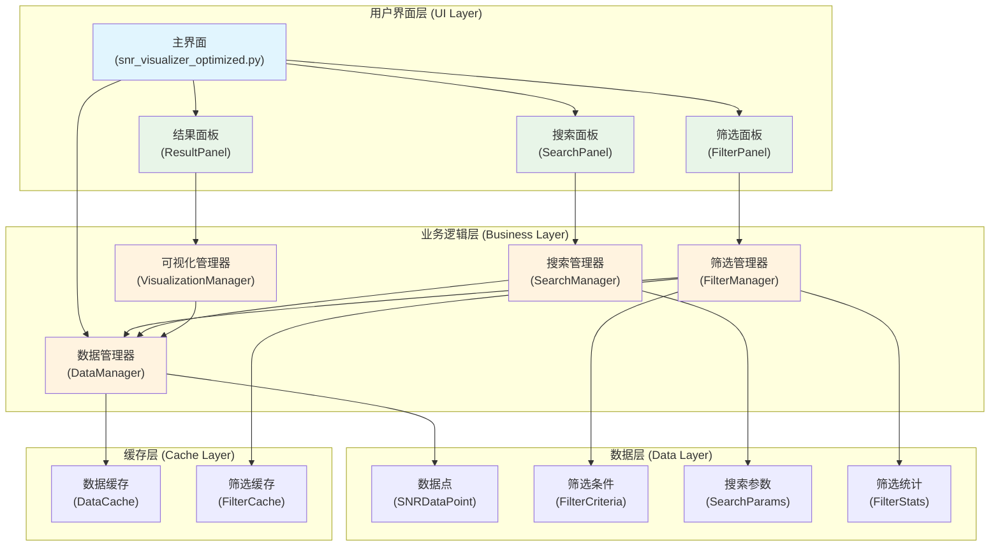
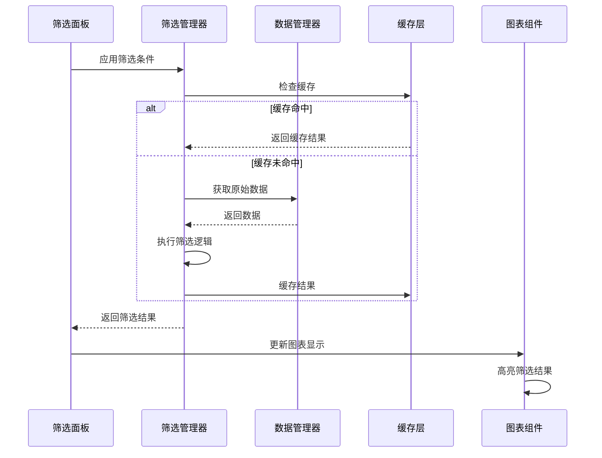
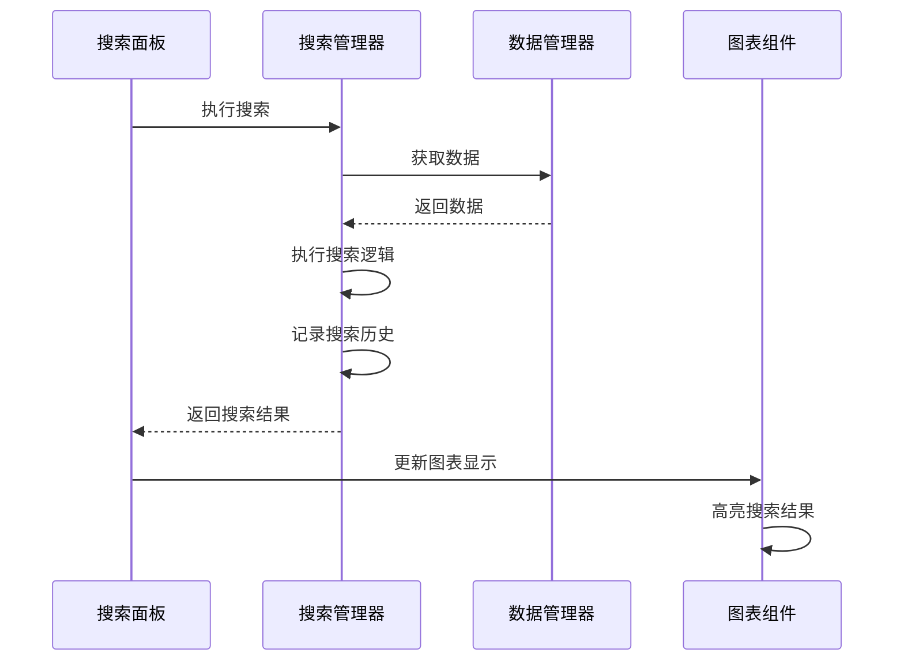

# V2.1 数据筛选和搜索功能 - 系统架构设计

**创建日期**: 2024年12月  
**功能版本**: V2.1  
**设计状态**: 架构设计完成  

---

## 🏗️ 整体架构设计

### 系统架构图



### 分层设计说明

#### 1. 用户界面层 (UI Layer)
- **主界面**: 集成筛选功能到现有界面
- **筛选面板**: 参数范围筛选控件
- **搜索面板**: 精确搜索控件
- **结果面板**: 筛选结果显示和操作

#### 2. 业务逻辑层 (Business Layer)
- **数据管理器**: 扩展现有DataManager，添加筛选接口
- **筛选管理器**: 处理筛选逻辑和条件管理
- **搜索管理器**: 处理搜索逻辑和结果匹配
- **可视化管理器**: 处理筛选结果的图表显示

#### 3. 数据层 (Data Layer)
- **数据点**: 使用现有SNRDataPoint结构
- **筛选条件**: 新增筛选条件数据结构
- **搜索参数**: 新增搜索参数数据结构
- **筛选统计**: 新增筛选结果统计结构

#### 4. 缓存层 (Cache Layer)
- **数据缓存**: 利用现有缓存机制
- **筛选缓存**: 新增筛选结果缓存

---

## 🔧 核心组件设计

### 1. 筛选管理器 (FilterManager)

```python
class FilterManager:
    """
    筛选功能核心管理器
    负责筛选逻辑、条件管理和结果缓存
    """
    
    def __init__(self, data_manager: DataManager):
        self.data_manager = data_manager
        self.current_criteria = FilterCriteria()
        self.filter_cache = {}
        self.last_filtered_data = []
    
    # 核心筛选方法
    async def apply_filter(self, criteria: FilterCriteria) -> List[SNRDataPoint]
    def clear_filter(self) -> None
    def get_filter_statistics(self) -> FilterStats
    
    # 缓存管理
    def _get_cache_key(self, criteria: FilterCriteria) -> str
    def _cache_result(self, criteria: FilterCriteria, result: List[SNRDataPoint]) -> None
    def _get_cached_result(self, criteria: FilterCriteria) -> Optional[List[SNRDataPoint]]
    
    # 筛选逻辑
    def _filter_by_range(self, data: List[SNRDataPoint], criteria: FilterCriteria) -> List[SNRDataPoint]
    def _validate_criteria(self, criteria: FilterCriteria) -> bool
```

### 2. 搜索管理器 (SearchManager)

```python
class SearchManager:
    """
    搜索功能管理器
    负责精确搜索和模糊匹配
    """
    
    def __init__(self, data_manager: DataManager):
        self.data_manager = data_manager
        self.search_history = []
    
    # 核心搜索方法
    async def search_exact(self, params: SearchParams) -> List[SNRDataPoint]
    async def search_fuzzy(self, params: SearchParams) -> List[SNRDataPoint]
    def get_search_suggestions(self, partial_input: str) -> List[str]
    
    # 搜索历史
    def add_to_history(self, params: SearchParams) -> None
    def get_search_history(self) -> List[SearchParams]
    def clear_history(self) -> None
    
    # 搜索逻辑
    def _match_exact_values(self, data: List[SNRDataPoint], params: SearchParams) -> List[SNRDataPoint]
    def _match_snr_with_tolerance(self, data: List[SNRDataPoint], target_snr: float, tolerance: float) -> List[SNRDataPoint]
```

### 3. 筛选面板 (FilterPanel)

```python
class FilterPanel(tk.Frame):
    """
    筛选功能UI面板
    提供参数范围筛选界面
    """
    
    def __init__(self, parent, filter_manager: FilterManager, callback):
        super().__init__(parent)
        self.filter_manager = filter_manager
        self.on_filter_applied = callback
        self.setup_ui()
    
    # UI构建
    def setup_ui(self) -> None
    def create_range_input(self, label: str, row: int) -> Tuple[tk.Entry, tk.Entry]
    def create_control_buttons(self) -> None
    
    # 事件处理
    def on_apply_filter(self) -> None
    def on_clear_filter(self) -> None
    def on_range_changed(self, param_type: str) -> None
    
    # 数据绑定
    def get_filter_criteria(self) -> FilterCriteria
    def set_filter_criteria(self, criteria: FilterCriteria) -> None
    def validate_input(self) -> bool
```

### 4. 搜索面板 (SearchPanel)

```python
class SearchPanel(tk.Frame):
    """
    搜索功能UI面板
    提供精确搜索界面
    """
    
    def __init__(self, parent, search_manager: SearchManager, callback):
        super().__init__(parent)
        self.search_manager = search_manager
        self.on_search_executed = callback
        self.setup_ui()
    
    # UI构建
    def setup_ui(self) -> None
    def create_search_inputs(self) -> None
    def create_search_buttons(self) -> None
    
    # 事件处理
    def on_search_exact(self) -> None
    def on_search_fuzzy(self) -> None
    def on_clear_search(self) -> None
    
    # 数据绑定
    def get_search_params(self) -> SearchParams
    def set_search_params(self, params: SearchParams) -> None
    def show_search_suggestions(self, suggestions: List[str]) -> None
```

---

## 📊 数据结构设计

### 1. 筛选条件 (FilterCriteria)

```python
@dataclass
class FilterCriteria:
    """
    筛选条件数据结构
    """
    pre_range: Optional[Tuple[int, int]] = None
    main_range: Optional[Tuple[int, int]] = None
    post_range: Optional[Tuple[int, int]] = None
    snr_range: Optional[Tuple[float, float]] = None
    
    # 辅助方法
    def is_empty(self) -> bool:
        """检查是否为空筛选条件"""
        return all([
            self.pre_range is None,
            self.main_range is None,
            self.post_range is None,
            self.snr_range is None
        ])
    
    def to_dict(self) -> Dict[str, Any]:
        """转换为字典格式"""
        return asdict(self)
    
    def __hash__(self) -> int:
        """支持缓存键生成"""
        return hash(str(self.to_dict()))
```

### 2. 搜索参数 (SearchParams)

```python
@dataclass
class SearchParams:
    """
    搜索参数数据结构
    """
    pre_value: Optional[int] = None
    main_value: Optional[int] = None
    post_value: Optional[int] = None
    snr_value: Optional[float] = None
    snr_tolerance: float = 0.01
    search_type: str = "exact"  # "exact" or "fuzzy"
    
    def is_empty(self) -> bool:
        """检查是否为空搜索参数"""
        return all([
            self.pre_value is None,
            self.main_value is None,
            self.post_value is None,
            self.snr_value is None
        ])
    
    def to_dict(self) -> Dict[str, Any]:
        """转换为字典格式"""
        return asdict(self)
```

### 3. 筛选统计 (FilterStats)

```python
@dataclass
class FilterStats:
    """
    筛选结果统计信息
    """
    total_count: int
    filtered_count: int
    filter_percentage: float
    
    # 参数统计
    pre_range: Tuple[int, int]
    main_range: Tuple[int, int]
    post_range: Tuple[int, int]
    snr_range: Tuple[float, float]
    
    # SNR统计
    avg_snr: float
    min_snr: float
    max_snr: float
    std_snr: float
    
    def to_summary_text(self) -> str:
        """生成统计摘要文本"""
        return f"筛选结果: {self.filtered_count}/{self.total_count} ({self.filter_percentage:.1f}%)"
```

---

## 🔄 数据流向设计

### 筛选操作数据流



### 搜索操作数据流



---

## 🔌 接口契约定义

### 1. FilterManager接口

```python
class IFilterManager(ABC):
    """
    筛选管理器接口契约
    """
    
    @abstractmethod
    async def apply_filter(self, criteria: FilterCriteria) -> List[SNRDataPoint]:
        """应用筛选条件"""
        pass
    
    @abstractmethod
    def clear_filter(self) -> None:
        """清除筛选条件"""
        pass
    
    @abstractmethod
    def get_filter_statistics(self) -> FilterStats:
        """获取筛选统计信息"""
        pass
    
    @abstractmethod
    def export_filtered_data(self, file_path: str) -> bool:
        """导出筛选结果"""
        pass
```

### 2. SearchManager接口

```python
class ISearchManager(ABC):
    """
    搜索管理器接口契约
    """
    
    @abstractmethod
    async def search_exact(self, params: SearchParams) -> List[SNRDataPoint]:
        """精确搜索"""
        pass
    
    @abstractmethod
    async def search_fuzzy(self, params: SearchParams) -> List[SNRDataPoint]:
        """模糊搜索"""
        pass
    
    @abstractmethod
    def get_search_suggestions(self, partial_input: str) -> List[str]:
        """获取搜索建议"""
        pass
```

### 3. 可视化接口扩展

```python
class IVisualizationManager(ABC):
    """
    可视化管理器接口扩展
    """
    
    @abstractmethod
    def highlight_filtered_data(self, filtered_data: List[SNRDataPoint]) -> None:
        """高亮筛选结果"""
        pass
    
    @abstractmethod
    def clear_highlights(self) -> None:
        """清除高亮显示"""
        pass
    
    @abstractmethod
    def update_legend_for_filter(self, stats: FilterStats) -> None:
        """更新图例显示筛选信息"""
        pass
```

---

## ⚡ 异常处理策略

### 1. 筛选异常处理

```python
class FilterException(Exception):
    """筛选操作异常"""
    pass

class InvalidFilterCriteriaException(FilterException):
    """无效筛选条件异常"""
    pass

class FilterTimeoutException(FilterException):
    """筛选超时异常"""
    pass

# 异常处理装饰器
def handle_filter_exceptions(func):
    @wraps(func)
    async def wrapper(*args, **kwargs):
        try:
            return await func(*args, **kwargs)
        except InvalidFilterCriteriaException as e:
            logger.error(f"无效筛选条件: {e}")
            raise
        except FilterTimeoutException as e:
            logger.error(f"筛选操作超时: {e}")
            raise
        except Exception as e:
            logger.error(f"筛选操作失败: {e}")
            raise FilterException(f"筛选操作失败: {e}")
    return wrapper
```

### 2. UI异常处理

```python
class UIException(Exception):
    """UI操作异常"""
    pass

class InvalidInputException(UIException):
    """无效输入异常"""
    pass

# UI异常处理
def safe_ui_operation(func):
    @wraps(func)
    def wrapper(*args, **kwargs):
        try:
            return func(*args, **kwargs)
        except InvalidInputException as e:
            messagebox.showerror("输入错误", str(e))
        except Exception as e:
            logger.error(f"UI操作失败: {e}")
            messagebox.showerror("操作失败", "操作失败，请重试")
    return wrapper
```

---

## 🚀 性能优化设计

### 1. 缓存策略

```python
class FilterCache:
    """
    筛选结果缓存管理
    """
    
    def __init__(self, max_size: int = 100):
        self.cache = OrderedDict()
        self.max_size = max_size
    
    def get(self, key: str) -> Optional[List[SNRDataPoint]]:
        if key in self.cache:
            # LRU: 移动到末尾
            self.cache.move_to_end(key)
            return self.cache[key]
        return None
    
    def put(self, key: str, value: List[SNRDataPoint]) -> None:
        if key in self.cache:
            self.cache.move_to_end(key)
        else:
            if len(self.cache) >= self.max_size:
                # 删除最久未使用的项
                self.cache.popitem(last=False)
        self.cache[key] = value
```

### 2. 异步处理

```python
class AsyncFilterProcessor:
    """
    异步筛选处理器
    """
    
    def __init__(self):
        self.executor = ThreadPoolExecutor(max_workers=2)
    
    async def process_filter(self, data: List[SNRDataPoint], criteria: FilterCriteria) -> List[SNRDataPoint]:
        """异步执行筛选操作"""
        loop = asyncio.get_event_loop()
        return await loop.run_in_executor(
            self.executor,
            self._filter_data_sync,
            data,
            criteria
        )
    
    def _filter_data_sync(self, data: List[SNRDataPoint], criteria: FilterCriteria) -> List[SNRDataPoint]:
        """同步筛选逻辑（在线程池中执行）"""
        # 使用Pandas进行向量化操作
        df = pd.DataFrame([asdict(point) for point in data])
        mask = self._build_filter_mask(df, criteria)
        filtered_df = df[mask]
        return [SNRDataPoint(**row) for _, row in filtered_df.iterrows()]
```

---

## 📋 设计验证清单

### 架构验证
- [x] 架构图清晰准确，层次分明
- [x] 模块职责明确，耦合度低
- [x] 接口定义完整，契约清晰
- [x] 与现有系统架构一致
- [x] 支持未来扩展需求

### 性能验证
- [x] 缓存策略合理有效
- [x] 异步处理设计正确
- [x] 内存使用控制合理
- [x] 响应时间目标可达成

### 可维护性验证
- [x] 代码结构清晰易懂
- [x] 异常处理策略完善
- [x] 接口设计支持测试
- [x] 文档完整准确

---

*文档创建日期: 2024年12月*  
*最后更新: 2024年12月*  
*设计状态: 架构设计完成，准备进入原子化阶段*