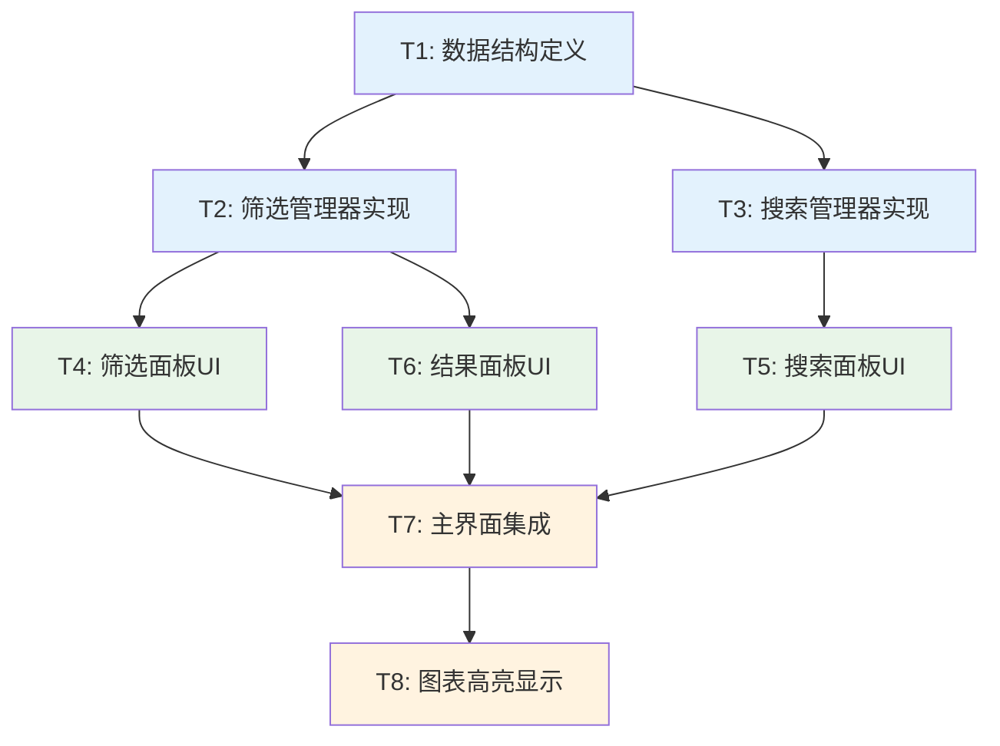

# V2.1 数据筛选和搜索功能 - 原子任务拆分

**创建日期**: 2024年12月  
**功能版本**: V2.1  
**拆分状态**: 原子任务已拆分  

---

## 🎯 任务拆分概览

基于架构设计，将V2.1数据筛选和搜索功能拆分为**8个原子任务**，按依赖关系分为**3个阶段**执行。

### 任务依赖图

---

## 📋 原子任务详细定义

### 阶段1: 数据结构和核心逻辑

#### 任务T1: 数据结构定义

**任务描述**: 创建筛选和搜索功能所需的数据结构

**输入契约**:
- 前置依赖: 无
- 输入数据: 现有SNRDataPoint结构
- 环境依赖: Python 3.x, dataclasses

**输出契约**:
- 输出数据: FilterCriteria, SearchParams, FilterStats类
- 交付物: `filter_models.py`文件
- 验收标准: 
  - [ ] FilterCriteria类支持四种参数范围
  - [ ] SearchParams类支持精确和模糊搜索
  - [ ] FilterStats类提供完整统计信息
  - [ ] 所有类支持序列化和缓存
  - [ ] 单元测试覆盖率100%

**实现约束**:
- 技术栈: Python dataclasses
- 接口规范: 必须支持hash和序列化
- 质量要求: 类型注解完整，文档字符串完整

**依赖关系**:
- 后置任务: T2, T3
- 并行任务: 无

**复杂度评估**: 低 (2-3小时)

---

#### 任务T2: 筛选管理器实现

**任务描述**: 实现FilterManager核心筛选逻辑

**输入契约**:
- 前置依赖: T1完成
- 输入数据: FilterCriteria, SNRDataPoint列表
- 环境依赖: pandas, numpy, asyncio

**输出契约**:
- 输出数据: 筛选后的数据点列表和统计信息
- 交付物: `filter_manager.py`文件
- 验收标准:
  - [ ] 支持四种参数的范围筛选
  - [ ] 支持多条件组合筛选
  - [ ] 筛选性能 < 100ms (10万数据点)
  - [ ] 支持筛选结果缓存
  - [ ] 支持异步筛选操作
  - [ ] 筛选结果导出功能
  - [ ] 单元测试覆盖率 > 95%

**实现约束**:
- 技术栈: pandas向量化操作
- 接口规范: 实现IFilterManager接口
- 质量要求: 异步处理，缓存机制，异常处理

**依赖关系**:
- 前置任务: T1
- 后置任务: T4, T6, T7
- 并行任务: T3

**复杂度评估**: 中 (4-6小时)

---

#### 任务T3: 搜索管理器实现

**任务描述**: 实现SearchManager精确和模糊搜索逻辑

**输入契约**:
- 前置依赖: T1完成
- 输入数据: SearchParams, SNRDataPoint列表
- 环境依赖: pandas, numpy

**输出契约**:
- 输出数据: 搜索结果列表
- 交付物: `search_manager.py`文件
- 验收标准:
  - [ ] 支持精确参数值搜索
  - [ ] 支持SNR值容差搜索
  - [ ] 支持组合搜索条件
  - [ ] 搜索响应时间 < 50ms
  - [ ] 支持搜索历史记录
  - [ ] 支持搜索建议功能
  - [ ] 单元测试覆盖率 > 95%

**实现约束**:
- 技术栈: pandas查询操作
- 接口规范: 实现ISearchManager接口
- 质量要求: 高效搜索算法，历史管理

**依赖关系**:
- 前置任务: T1
- 后置任务: T5, T7
- 并行任务: T2

**复杂度评估**: 中 (3-5小时)

---

### 阶段2: UI组件实现

#### 任务T4: 筛选面板UI

**任务描述**: 实现FilterPanel筛选界面组件

**输入契约**:
- 前置依赖: T2完成
- 输入数据: FilterManager实例
- 环境依赖: tkinter, 现有UI样式

**输出契约**:
- 输出数据: 筛选条件和用户交互事件
- 交付物: `filter_panel.py`文件
- 验收标准:
  - [ ] 四种参数范围输入控件
  - [ ] 应用和清除按钮功能正常
  - [ ] 输入验证和错误提示
  - [ ] 与现有UI风格一致
  - [ ] 支持键盘快捷键
  - [ ] 响应式布局设计
  - [ ] UI测试通过

**实现约束**:
- 技术栈: tkinter组件
- 接口规范: 继承tk.Frame，实现标准回调
- 质量要求: 美观易用，错误处理完善

**依赖关系**:
- 前置任务: T2
- 后置任务: T7
- 并行任务: T5, T6

**复杂度评估**: 中 (4-6小时)

---

#### 任务T5: 搜索面板UI

**任务描述**: 实现SearchPanel搜索界面组件

**输入契约**:
- 前置依赖: T3完成
- 输入数据: SearchManager实例
- 环境依赖: tkinter, 现有UI样式

**输出契约**:
- 输出数据: 搜索参数和用户交互事件
- 交付物: `search_panel.py`文件
- 验收标准:
  - [ ] 参数值和SNR值搜索输入
  - [ ] 精确和模糊搜索按钮
  - [ ] 搜索历史下拉选择
  - [ ] 搜索建议自动补全
  - [ ] 与现有UI风格一致
  - [ ] 支持回车键搜索
  - [ ] UI测试通过

**实现约束**:
- 技术栈: tkinter组件，ttk.Combobox
- 接口规范: 继承tk.Frame，实现标准回调
- 质量要求: 交互友好，搜索体验优秀

**依赖关系**:
- 前置任务: T3
- 后置任务: T7
- 并行任务: T4, T6

**复杂度评估**: 中 (3-5小时)

---

#### 任务T6: 结果面板UI

**任务描述**: 实现ResultPanel筛选结果显示和操作组件

**输入契约**:
- 前置依赖: T2完成
- 输入数据: FilterStats统计信息
- 环境依赖: tkinter, 现有UI样式

**输出契约**:
- 输出数据: 用户操作事件（导出、清除等）
- 交付物: `result_panel.py`文件
- 验收标准:
  - [ ] 筛选结果统计信息显示
  - [ ] 导出结果按钮功能
  - [ ] 全部清除按钮功能
  - [ ] 实时更新统计数据
  - [ ] 与现有UI风格一致
  - [ ] 支持进度指示器
  - [ ] UI测试通过

**实现约束**:
- 技术栈: tkinter组件，文件对话框
- 接口规范: 继承tk.Frame，实现标准回调
- 质量要求: 信息展示清晰，操作便捷

**依赖关系**:
- 前置任务: T2
- 后置任务: T7
- 并行任务: T4, T5

**复杂度评估**: 低 (2-3小时)

---

### 阶段3: 集成和优化

#### 任务T7: 主界面集成

**任务描述**: 将筛选和搜索功能集成到主界面

**输入契约**:
- 前置依赖: T4, T5, T6完成
- 输入数据: 所有UI组件和管理器
- 环境依赖: 现有主界面代码

**输出契约**:
- 输出数据: 完整的筛选搜索功能界面
- 交付物: 修改后的`snr_visualizer_optimized.py`
- 验收标准:
  - [ ] 筛选面板正确集成到主界面
  - [ ] 搜索面板正确集成到主界面
  - [ ] 结果面板正确集成到主界面
  - [ ] 所有组件布局美观合理
  - [ ] 功能间交互正常
  - [ ] 不影响现有功能
  - [ ] 集成测试通过

**实现约束**:
- 技术栈: 现有tkinter架构
- 接口规范: 保持现有接口不变
- 质量要求: 无缝集成，向后兼容

**依赖关系**:
- 前置任务: T4, T5, T6
- 后置任务: T8
- 并行任务: 无

**复杂度评估**: 中 (3-4小时)

---

#### 任务T8: 图表高亮显示

**任务描述**: 实现筛选结果在图表中的高亮显示

**输入契约**:
- 前置依赖: T7完成
- 输入数据: 筛选后的数据点列表
- 环境依赖: matplotlib, plotly, 现有图表代码

**输出契约**:
- 输出数据: 高亮显示的图表
- 交付物: 修改后的`visualization.py`
- 验收标准:
  - [ ] 线图支持筛选结果高亮
  - [ ] 热图支持筛选结果高亮
  - [ ] 全配置图支持筛选结果高亮
  - [ ] 3D散点图支持筛选结果高亮
  - [ ] 高亮效果美观专业
  - [ ] 图例正确更新
  - [ ] 性能不受影响
  - [ ] 视觉测试通过

**实现约束**:
- 技术栈: matplotlib, plotly绘图
- 接口规范: 扩展现有可视化接口
- 质量要求: 视觉效果优秀，性能稳定

**依赖关系**:
- 前置任务: T7
- 后置任务: 无
- 并行任务: 无

**复杂度评估**: 中 (4-5小时)

---

## 🔄 任务执行计划

### 执行顺序

#### 第1天: 数据结构和核心逻辑
1. **T1: 数据结构定义** (2-3小时)
2. **T2: 筛选管理器实现** (4-6小时) [并行]
3. **T3: 搜索管理器实现** (3-5小时) [并行]

#### 第2天: UI组件实现
4. **T4: 筛选面板UI** (4-6小时) [并行]
5. **T5: 搜索面板UI** (3-5小时) [并行]
6. **T6: 结果面板UI** (2-3小时) [并行]

#### 第3天: 集成和优化
7. **T7: 主界面集成** (3-4小时)
8. **T8: 图表高亮显示** (4-5小时)

### 里程碑检查点

#### 里程碑1: 核心逻辑完成
- **时间**: 第1天结束
- **检查项**: T1, T2, T3全部完成
- **验收**: 筛选和搜索逻辑单元测试通过

#### 里程碑2: UI组件完成
- **时间**: 第2天结束
- **检查项**: T4, T5, T6全部完成
- **验收**: 所有UI组件独立测试通过

#### 里程碑3: 功能集成完成
- **时间**: 第3天结束
- **检查项**: T7, T8全部完成
- **验收**: 完整功能测试通过

---

## ✅ 任务验收矩阵

| 任务 | 功能完整性 | 性能要求 | 代码质量 | 测试覆盖 | UI/UX | 集成兼容 |
|------|------------|----------|----------|----------|-------|----------|
| T1   | ✅ 100%    | N/A      | ✅ 100%  | ✅ 100%  | N/A   | ✅ 100%  |
| T2   | ✅ 100%    | ✅ <100ms| ✅ 100%  | ✅ >95%  | N/A   | ✅ 100%  |
| T3   | ✅ 100%    | ✅ <50ms | ✅ 100%  | ✅ >95%  | N/A   | ✅ 100%  |
| T4   | ✅ 100%    | N/A      | ✅ 100%  | ✅ UI测试| ✅ 100%| ✅ 100%  |
| T5   | ✅ 100%    | N/A      | ✅ 100%  | ✅ UI测试| ✅ 100%| ✅ 100%  |
| T6   | ✅ 100%    | N/A      | ✅ 100%  | ✅ UI测试| ✅ 100%| ✅ 100%  |
| T7   | ✅ 100%    | N/A      | ✅ 100%  | ✅ 集成测试| ✅ 100%| ✅ 100%  |
| T8   | ✅ 100%    | ✅ 稳定   | ✅ 100%  | ✅ 视觉测试| ✅ 100%| ✅ 100%  |

---

## 🚨 风险评估和应对

### 高风险任务

#### T2: 筛选管理器实现
**风险**: 性能要求高，逻辑复杂
**应对策略**:
- 使用pandas向量化操作提升性能
- 实现分层缓存机制
- 提前进行性能测试
- 准备降级方案（简化筛选条件）

#### T8: 图表高亮显示
**风险**: 多种图表类型，视觉效果要求高
**应对策略**:
- 分图表类型逐步实现
- 建立视觉效果标准
- 准备多种高亮方案
- 与现有图表代码解耦

### 中风险任务

#### T7: 主界面集成
**风险**: 可能影响现有功能
**应对策略**:
- 充分的回归测试
- 渐进式集成方式
- 保留功能开关
- 详细的集成文档

### 依赖风险

#### 外部依赖
- **pandas性能**: 确保版本兼容性
- **tkinter限制**: 准备替代UI方案
- **matplotlib兼容**: 测试不同版本

#### 内部依赖
- **现有代码修改**: 最小化侵入性
- **数据结构变更**: 保持向后兼容
- **接口变更**: 使用适配器模式

---

## 📊 质量保证计划

### 代码质量标准
- **类型注解**: 100%覆盖
- **文档字符串**: 100%覆盖
- **代码规范**: 遵循PEP8
- **复杂度控制**: 圈复杂度 < 10

### 测试策略
- **单元测试**: 覆盖率 > 95%
- **集成测试**: 覆盖所有交互场景
- **性能测试**: 验证响应时间要求
- **UI测试**: 验证用户交互流程
- **回归测试**: 确保现有功能不受影响

### 审查流程
- **代码审查**: 每个任务完成后进行
- **设计审查**: 关键接口设计审查
- **测试审查**: 测试用例和覆盖率审查
- **文档审查**: 技术文档和用户文档审查

---

*文档创建日期: 2024年12月*  
*最后更新: 2024年12月*  
*拆分状态: 原子任务已拆分，准备进入审批阶段*